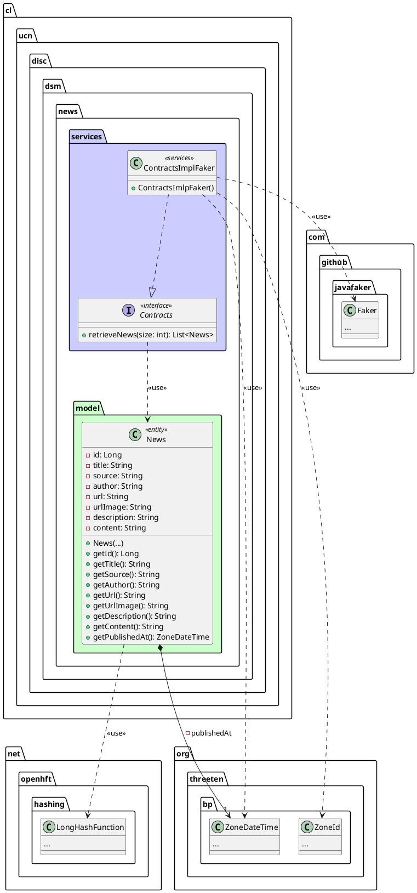

#The News Projects

Android Project to show a list of News.

##Class Model

```puml
@startuml
package org.threeten.bp{
        class ZoneDateTime{
            ...
        }
        class ZoneId{
        ...
        }
}
package net.openhft.hashing{
    class LongHashFunction{
        ...
    }
}
package com.github.javafaker{
    class Faker{
        ...
    }
}
package cl.ucn.disc.dsm.news{

    package model #ccffcc{
    
        class News <<entity>>{
            -id: Long
            -title: String
            -source: String
            -author: String
            -url: String
            -urlImage: String
            -description: String
            -content: String
            +News(...)
            +getId(): Long
            +getTitle(): String
            +getSource(): String
            +getAuthor(): String
            +getUrl(): String
            +getUrlImage(): String
            +getDescription(): String
            +getContent(): String
            +getPublishedAt(): ZoneDateTime
        }
        News *--> "1" ZoneDateTime: -publishedAt
        News ..> LongHashFunction : <<use>>
    }
    
    package services #ccccff{
        interface Contracts <<interface>>{
            + retrieveNews(size: int): List<News>
        }
        Contracts ..> News : <<use>>
        class ContractsImplFaker <<services>>{
            + ContractsImlpFaker()
        }
        ContractsImplFaker ..|> Contracts
        ContractsImplFaker ..> ZoneDateTime : <<use>>
        ContractsImplFaker ..> ZoneId : <<use>>
        ContractsImplFaker ..> Faker : <<use>>
        
    }
    
}
@enduml
```

##License
[MIT](http://choosealicense.com/licenses/mit/)